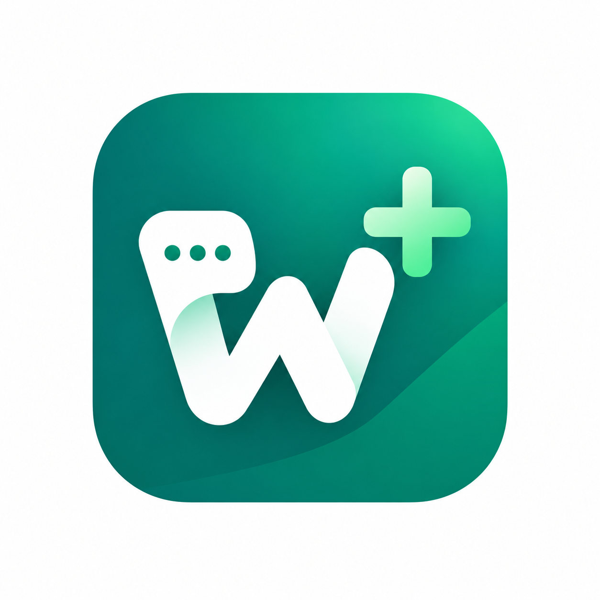

<table>
<tr>
<td width="140" align="center" valign="top">

</td>
<td valign="top">
<h1>WAP Plus CRM</h1>
<p>WhatsApp 销售 CRM：默认使用内嵌 Baileys 收发消息，也支持 Android Bridge 作为备用通道。</p>
</td>
<td align="right" valign="top">
<strong>支持赞助</strong><br /><br />
<a href="https://buymeacoffee.com/kevinlabs26"></a><br />
<a href="https://ko-fi.com/kevinlabs"></a><br />
<a href="https://kevinlabs.lemonsqueezy.com/checkout/buy/7b60b363-50b5-4233-a982-91a0611eccd6"></a>
</td>
</tr>
</table>

[English documentation](README.md)

> **公开仓库说明：** 本项目是个人/社区实验性软件，与 WhatsApp 无官方关联。Baileys 和 Android Accessibility 通道可能受到平台规则、版本变化或账号限制影响，请自行评估合规性和账号风险。不要将本项目宣传为“防封”工具。

WAP Plus CRM 用于在电脑上管理客户、会话、AI 辅助和销售跟进。消息默认通过内嵌 Baileys 通道收发，也支持通过真实 WhatsApp Business 手机使用 Android Bridge。设备/通道层只是消息传输方式，不是产品主界面。本项目不使用 WhatsApp Cloud API。

更多信息请查看[需求文档](docs/REQUIREMENTS.md)、[架构文档](docs/ARCHITECTURE.md)和[通道文档](docs/CHANNELS.md)。

## 隐私与安全边界

- 消息、联系人、SQLite 数据库和 Baileys 登录凭证默认保存在本机。本版本不提供端到端云同步，也不保证本地数据库静态加密。
- API Key 仅用于本机 AI 请求。使用第三方 AI 提供商时，发送给模型的内容取决于你主动触发的功能和所选提供商，请先阅读对应的隐私政策。
- 不要提交 `reasonix.toml`、`.reasonix/`、`baileys-auth/`、数据库、日志、导出文件、真实 Token 或 API Key。
- 公开提交问题时，不要粘贴手机号、聊天内容、二维码、登录凭证或完整日志。安全问题请参考 [SECURITY.md](SECURITY.md)。

## 仓库结构

```text
WAP Plus CRM/
├── docs/                 # 需求、架构、通道和协议文档
│   └── protocol-plan/    # 历史协议记录，不是当前事实来源
├── shared/               # 共享协议定义和契约测试数据
├── desktop/              # Tauri 2 + React + TypeScript + Drizzle 桌面应用
│   ├── src/              # 会话、CRM 和设置界面
│   ├── baileys-bridge/   # 内嵌 Baileys Node sidecar
│   └── src-tauri/        # 负责 ADB、Bridge 和 Baileys 进程的 Rust 宿主
├── android/              # Kotlin Android Bridge 服务和悬浮层
├── tools/                # 跨平台开发工具
├── package.json          # npm workspace 配置
├── package-lock.json     # 根依赖锁文件
├── .env.example          # 环境变量模板
└── README.md
```

## 安装

在仓库根目录安装桌面端和 Baileys sidecar：

```bash
npm install
```

常用命令：

| 命令 | 作用 |
|---|---|
| `npm run dev` | 启动 Vite 桌面界面 |
| `npm run tauri -- dev` | 启动 Tauri 桌面壳，需要 Rust 和 WebView2 |
| `npm run release:win` | 构建 Windows Tauri 安装包，同时生成 Baileys sidecar |
| `npm test` | 运行桌面协议和单元测试 |
| `npm run mock-bridge` | 启动本地 Android TCP Bridge 模拟器 |
| `npm run baileys:build` | 构建 Baileys sidecar，需要 Bun |

也可以进入 `desktop/` 或 `desktop/baileys-bridge/` 单独操作。`shared/` 通过 Desktop 的 `@shared/*` 路径别名使用。Android 项目可用 Android Studio 打开，或使用 Gradle 构建。

## 快速开始

### 桌面界面

无需 Rust 即可先启动浏览器版界面：

```bash
npm install
npm run dev
```

浏览器打开 http://localhost:3000。浏览器模式无法启动 Baileys 子进程；需要扫码收发消息时，请使用 Tauri 桌面壳。

### 完整 Tauri 桌面壳

先安装 [Rust](https://rustup.rs) 和 Windows WebView2，然后运行：

```bash
npm install
npm run tauri -- dev
```

在设置或顶部栏打开 **连接 WhatsApp** 并扫描二维码。手机通道请参考 [Android Bridge 配置指南](docs/BRIDGE_SETUP.md)。

本地构建 Windows 安装包：

```bash
npm run release:win
```

该命令会自动生成 Baileys sidecar，因此 sidecar 不提交到 Git。安装包会输出到 `desktop/src-tauri/target/release/bundle/`。

### 桌面端自动更新

自动更新需要先配置 GitHub 仓库地址和 Tauri 签名密钥。完整步骤见[自动更新发布说明](docs/UPDATES.md)。每次发布时递增 `desktop/src-tauri/tauri.conf.json` 的版本号并推送 `v*` 标签；GitHub Actions 会生成签名安装包和 `latest.json`。Draft Release 发布后，已安装的桌面端才会检测到更新。

### Android Bridge

用 Android Studio 打开 `android/`，或运行：

```bash
cd android
./gradlew :app:assembleDebug
adb install -r app/build/outputs/apk/debug/app-debug.apk
adb forward tcp:17890 tcp:17890
```

详情请查看 [Android 指南](android/README.md)。

## 核心能力

1. **AI 客户卡片** —— 自动展示身份、阶段、摘要和跟进信息。
2. **联系人手机绑定** —— 打开联系人时，可为 Android Bridge 通道选择关联手机。

## 技术栈

| 领域 | 技术 |
|---|---|
| 桌面端 | Tauri 2 · React · TypeScript · Tailwind · Zustand · Drizzle · SQLite |
| 默认通道 | 通过桌面 sidecar 运行的内嵌 Baileys |
| 备用通道 | Kotlin · Accessibility · Overlay · ADB Android Bridge |
| 协议 | 基于 TCP/WebSocket/ADB 的 JSON envelope |

## 许可证

本项目使用 [Apache License 2.0](LICENSE) 授权。
